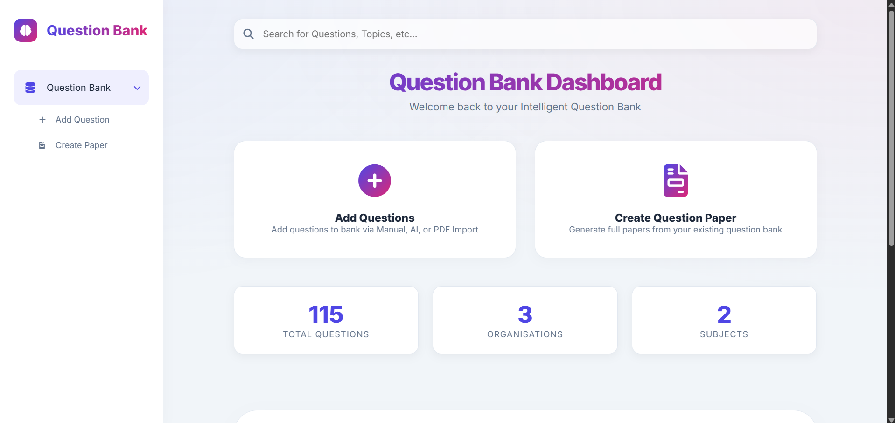
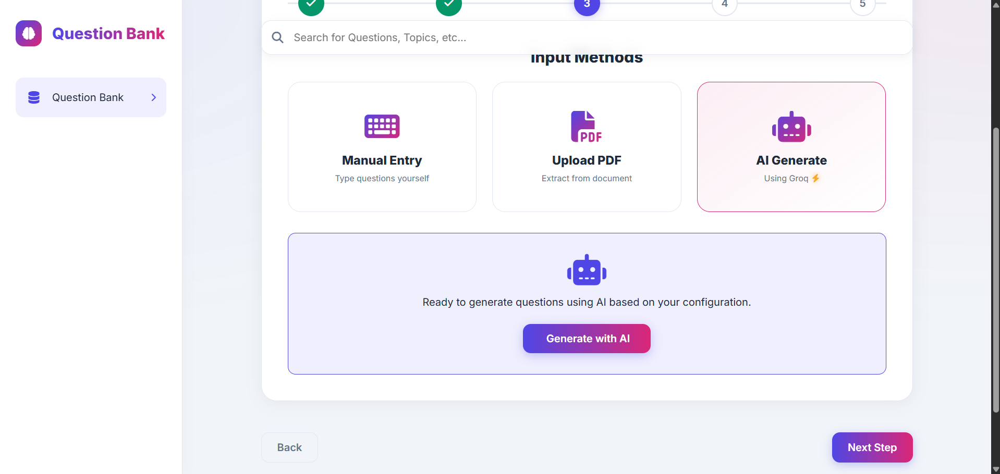
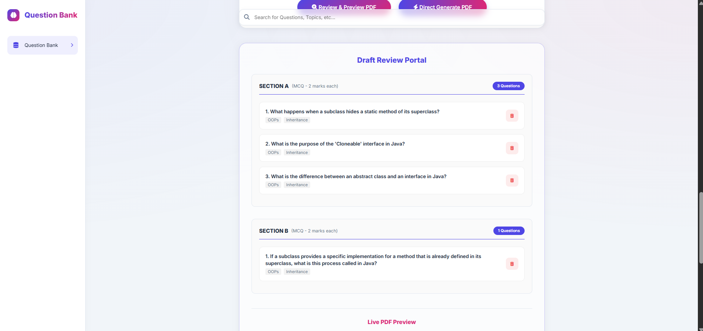
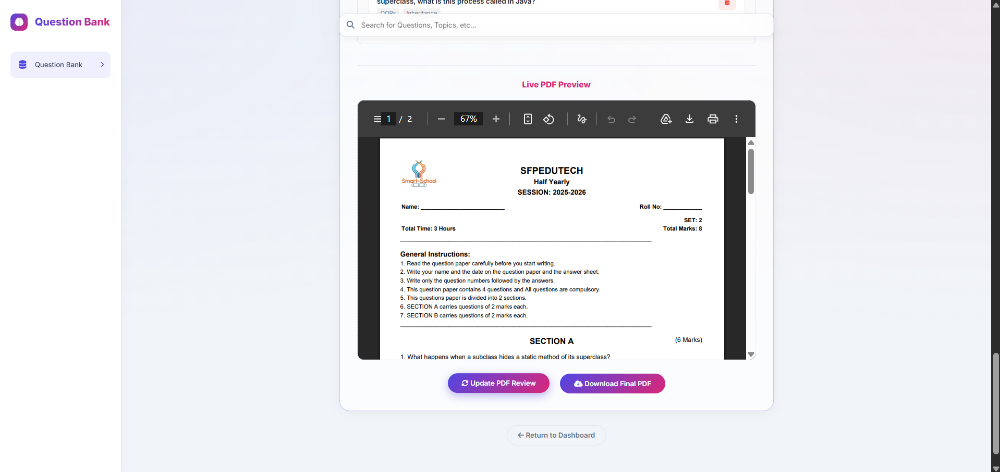

# 🎓 QuestBank: Advanced Question Bank & Paper Generator

<<<<<<< HEAD


[](https://spring.io/projects/spring-boot)
[](https://www.oracle.com/java/)
[](https://www.mysql.com/)
[](LICENSE)
=======
<div align="center">
  
  <p align="center">
    <strong>A comprehensive, premium solution for managing events, bookings, and ticket generation.</strong>
  </p>

  [](https://spring.io/projects/spring-boot)
  [](https://www.oracle.com/java/)
  [](https://www.mysql.com/)
</div>
>>>>>>> 9c5a67214cc5b16437261596bcb192dac278283d

**QuestBank** is a sophisticated, AI-enhanced Spring Boot application designed to streamline the process of creating, managing, and generating academic question papers. Whether you need to import questions from PDFs, generate new ones using AI, or organize complex multi-section exams, QuestBank provides a clean and professional solution.

---

## ✨ Features

### 🤖 AI-Powered Generation
Generate high-quality questions instantly using integration with **Groq AI**. Simply provide a topic, and QuestBank will handle the rest.

### 📄 PDF Intelligence
*   **Import**: Extract questions directly from existing PDF documents.
*   **Export**: Generate professional, ready-to-print question papers in PDF format.
*   **Customization**: Include organization logos and custom headers automatically.

### 🗄️ Robust Question Bank
Manage thousand of questions with ease. Categorize by:
*   **Subject & Chapter**
*   **Topic & Difficulty** (Easy, Medium, Hard)
*   **Question Type** (MCQ, Short Answer, Long Answer)
*   **Marks Allocation**

### ✍️ Professional Paper Generation
*   **Manual Selection**: Choose specific questions for your paper.
*   **Randomized Generation**: Auto-generate papers based on specific criteria (e.g., "Give me 10 easy MCQ questions for Physics Topic X").
*   **Sectioned Papers**: Create complex exams with Section A, B, C, etc., each with its own rules.
*   **Preview & Edit**: Review and swap questions before final generation.

### 🔐 Secure & Modern
*   **JWT Authentication**: Secure login and session management.
*   **Role-Based Access**: Control who can modify the bank vs. generate papers.
*   **Professional UI**: Built with Thymeleaf and modern CSS for a premium feel.

---

## 🛠️ Technology Stack

| Layer | Technology |
|---|---|
| **Backend** | Java 17, Spring Boot 3.4.2 |
| **Security** | Spring Security, JWT (jjwt) |
| **Database** | MySQL, Spring Data JPA |
| **Frontend** | Thymeleaf, Vanilla CSS, JavaScript |
| **PDF Tools** | OpenPDF (Generation), PDFBox (Extraction) |
| **AI** | Groq API Integration |
| **Build Tool** | Maven |

---

## 🚀 Getting Started

### Prerequisites
*   **JDK 17** or higher
*   **MySQL Server**
*   **Maven 3.x**
*   **Groq API Key** (for AI features)

### Installation

1.  **Clone the repository**
    ```bash
    git clone https://github.com/Deepansh1822/QuestBank.git
    cd QuestBank
    ```

2.  **Database Setup**
    Create a database named `questionbankdb` in MySQL:
    ```sql
    CREATE DATABASE questionbankdb;
    ```

3.  **Configuration**
    Update `src/main/resources/application.properties` with your credentials:
    ```properties
    spring.datasource.username=YOUR_USERNAME
    spring.datasource.password=YOUR_PASSWORD
    groq.api.key=YOUR_GROQ_API_KEY
    ```

4.  **Build & Run**
    ```bash
    mvn clean install
    mvn spring-boot:run
    ```
    The application will be available at `http://localhost:8081`.

---

## 📸 Screenshots

<<<<<<< HEAD

*Professional Dashboard Interface*
=======
<table align="center">
  <tr>
    <td align="center"><b>Dashboard</b></td>
    <td align="center"><b>QuestionBank Generator</b></td>
    <td align="center"><b>Questions Generation Methods</b></td>
  </tr>
  <tr>
    <td></td>
    <td></td>
    <td></td>
  </tr>
  <tr>
    <td align="center" colspan="1.5"><b>Review & Edit Paper</b></td>
    <td align="center" colspan="1.5"><b>Final PDF Preview</b></td>
    <td></td> <!-- Spacing cell -->
  </tr>
  <tr>
    <td colspan="1.5"></td>
    <td colspan="1.5"></td>
    <td></td>
  </tr>
</table>
>>>>>>> 9c5a67214cc5b16437261596bcb192dac278283d

---

## 📂 Project Structure

```text
QuestBank/
├── src/
│   ├── main/
│   │   ├── java/in/sfp/main/
│   │   │   ├── controllers/      # Web Endpoints
│   │   │   ├── models/           # JPA Entities
│   │   │   ├── service/          # Business Logic (AI, PDF, Math)
│   │   │   └── security/         # JWT & Security Config
│   │   └── resources/
│   │       ├── templates/        # Thymeleaf Pages
│   │       └── static/           # CSS, JS, Images
├── pom.xml                       # Maven Dependencies
└── README.md                     # You are here!
```

---

## 🤝 Contributing

Contributions are welcome! Please feel free to submit a Pull Request.

1.  Fork the Project
2.  Create your Feature Branch (`git checkout -b feature/AmazingFeature`)
3.  Commit your Changes (`git commit -m 'Add some AmazingFeature'`)
4.  Push to the Branch (`git push origin feature/AmazingFeature`)
5.  Open a Pull Request

---

<<<<<<< HEAD
## 📄 License

This project is licensed under the MIT License - see the [LICENSE](LICENSE) file for details.

---

<p align="center">
  Made with ❤️ by <a href="https://github.com/Deepansh1822">Deepansh</a>
</p>
=======
<p align="center">
  Made with ❤️ by <a href="https://github.com/Deepansh1822">Deepansh</a>
</p>

>>>>>>> 9c5a67214cc5b16437261596bcb192dac278283d
